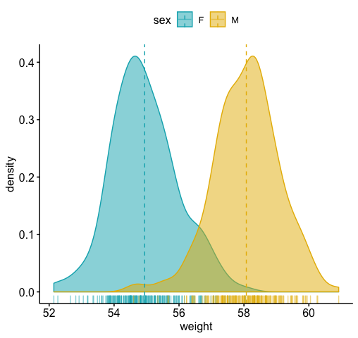
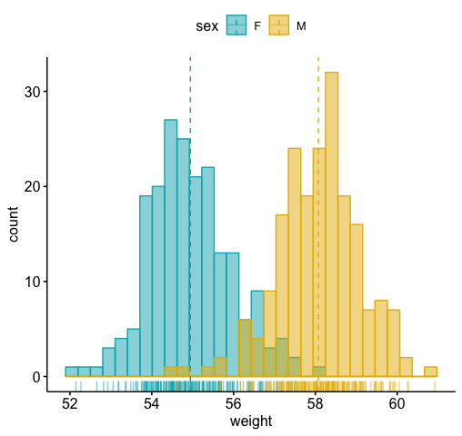
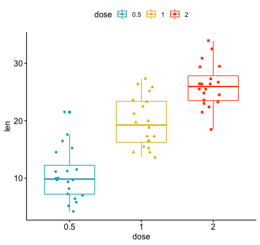
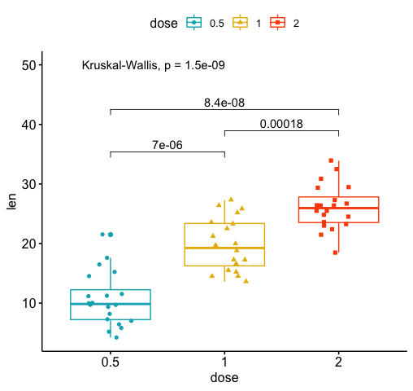

<!-- README.md is generated from README.Rmd. Please edit that file -->
[](https://travis-ci.org/kassambara/ggpubr) [](https://cran.r-project.org/package=ggpubr) [](https://cran.r-project.org/package=ggpubr) [](http://cranlogs.r-pkg.org/badges/grand-total/ggpubr)

ggpubr: 'ggplot2' Based Publication Ready Plots
===============================================

ggplot2 by [Hadley Wickham](http://docs.ggplot2.org/current/) is an excellent and flexible package for elegant data visualization in R. However the default generated plots requires some formatting before we can send them for publication. Furthermore, to customize a ggplot, the syntax is opaque and this raises the level of difficulty for researchers with no advanced R programming skills.

The 'ggpubr' package provides some easy-to-use functions for creating and customizing 'ggplot2'- based publication ready plots.

Installation and loading
------------------------

-   Install from [CRAN](https://cran.r-project.org/package=ggpubr) as follow:

``` r
install.packages("ggpubr")
```

-   Or, install the latest version from [GitHub](https://github.com/kassambara/ggpubr) as follow:

``` r
# Install
if(!require(devtools)) install.packages("devtools")
devtools::install_github("kassambara/ggpubr")
```

Geting started
--------------

Find out more at <http://www.sthda.com/english/rpkgs/ggpubr>.

### Density and histogram plots

``` r
library(ggpubr)
# Create some data format
# +++++++++++++++++++++++++++++++++++++++++++
set.seed(1234)
wdata = data.frame(
   sex = factor(rep(c("F", "M"), each=200)),
   weight = c(rnorm(200, 55), rnorm(200, 58)))
head(wdata, 4)
#>   sex   weight
#> 1   F 53.79293
#> 2   F 55.27743
#> 3   F 56.08444
#> 4   F 52.65430

# Density plot with mean lines and marginal rug
# +++++++++++++++++++++++++++++++++++++++++++
# Change outline and fill colors by groups ("sex")
# Use custom palette
ggdensity(wdata, x = "weight",
   add = "mean", rug = TRUE,
   color = "sex", fill = "sex",
   palette = c("#00AFBB", "#E7B800"))
```



``` r
# Histogram plot with mean lines and marginal rug
# +++++++++++++++++++++++++++++++++++++++++++
# Change outline and fill colors by groups ("sex")
# Use custom color palette
gghistogram(wdata, x = "weight",
   add = "mean", rug = TRUE,
   color = "sex", fill = "sex",
   palette = c("#00AFBB", "#E7B800"))
```



### Box plots and violin plots

``` r
# Load data
data("ToothGrowth")
df <- ToothGrowth
head(df, 4)
#>    len supp dose
#> 1  4.2   VC  0.5
#> 2 11.5   VC  0.5
#> 3  7.3   VC  0.5
#> 4  5.8   VC  0.5

# Box plots with jittered points
# ++++++++++++++++++++++++++++++++
# Change outline colors by groups: dose
# Use custom color palette
# Add jitter points and change the shape by groups
 ggboxplot(df, x = "dose", y = "len",
    color = "dose", palette =c("#00AFBB", "#E7B800", "#FC4E07"),
    add = "jitter", shape = "dose")
```



``` r
 
# Violin plots with box plots inside
# +++++++++++++++++++++++++++++++++
# Change fill color by groups: dose
# add boxplot with white fill color
ggviolin(df, x = "dose", y = "len", fill = "dose",
   palette = c("#00AFBB", "#E7B800", "#FC4E07"),
   add = "boxplot", add.params = list(fill = "white"))
```



### More

Find out more at <http://www.sthda.com/english/rpkgs/ggpubr>.

Blog posts
----------

-   A. Kassambara. STHDA Jully 2016. [ggpubr R Package: ggplot2-Based Publication Ready Plots](http://www.sthda.com/english/wiki/ggpubr-r-package-ggplot2-based-publication-ready-plots)
